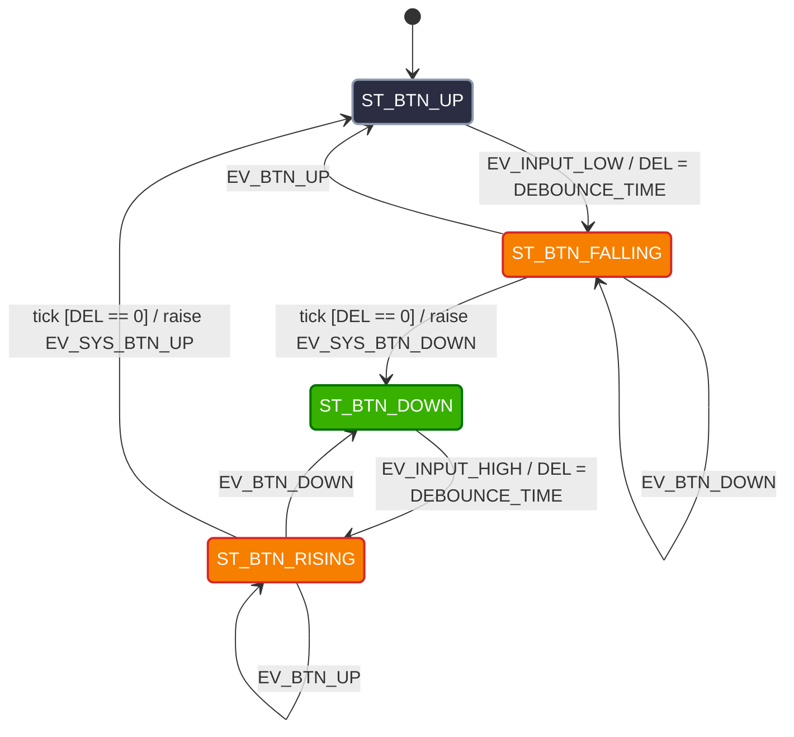

# Sensor Layer: Events, Actions & State Machine

## 1. Eventos y Acciones del Módulo Sensor

El módulo **Sensor** es el encargado de sensar el estado de los periféricos de entrada (pulsadores y DIP switches), aplicar el filtrado digital antirrebote por tiempo (*debouncing*) y notificar los eventos validados hacia la capa **System**.

### Entradas Digitales Mapeadas:
* `BTN_TICKET`: Pulsador de solicitud de ticket.
* `SEN_COIL_IN`: DIP Switch de presencia de vehículo en entrada (bobina de entrada).
* `SEN_CAM_OK`: DIP Switch / Pulsador que simula la captura y validación exitosa de la patente por la cámara.
* `SEN_COIL_OUT`: DIP Switch de presencia de vehículo en el área de paso (bobina de barrera).

---

### Definición de Eventos y Acciones Internas (Modelo por Tecla/Sensor)

* **Eventos de Hardware (Triggers de Entrada/Tiempo):**
  * `EV_INPUT_HIGH`: La entrada digital pasa a nivel alto ($3.3\text{V}$).
  * `EV_INPUT_LOW`: La entrada digital pasa a nivel bajo ($0\text{V}$).
* **Acciones y Signals (Notificaciones a la capa `System`):**
  * `EV_SYS_BTN_DOWN`: Signal emitida cuando se confirma la pulsación estable del botón de ticket.
  * `EV_SYS_BTN_UP`: Signal emitida cuando se confirma la liberación del botón de ticket.
  * `EV_SYS_CAR_ARRIVED`: Signal emitida cuando la bobina de entrada confirma la presencia de un auto.
  * `EV_SYS_CAM_VALIDATED`: Signal emitida cuando la cámara confirma la captura/lectura correcta de la patente.
  * `EV_SYS_CAR_PASSED`: Signal emitida cuando la bobina de barrera confirma que el vehículo atravesó el paso y la zona quedó libre.
  * `DEL_SENSOR_NAME = DEBOUNCE_TIME`: Carga del temporizador de filtrado de rebotes (ej. $20\text{ms}$).

---

## 2. Diagrama de Transición de Estados (Sensor FSM)

Cada entrada digital independiente ejecuta la siguiente máquina de estados genérica para garantizar que las señales recibidas por la capa `System` estén completamente libres de rebotes o falsos disparos.
El sensor principal estudiado es: **Ticket Button** para el cual utilizamos un Pulsador:

## Tabla de Transición de Estados del Módulo Sensor (STT)

### 1. Botón de Solicitud de Ticket (`BTN_TICKET`) -> SOLUCIÓN PASO 7

| Estado Actual | Evento / Entrada | Condición [Guardia] | Estado Siguiente | Acciones Realizadas |
| :--- | :--- | :--- | :--- | :--- |
| `ST_BTN_UP` | `EV_BTN_DOWN` | - | `ST_BTN_FALLING` | `tick=DEL_BTN_50ms` |
| `ST_BTN_UP` | `EV_BTN_UP` | - | - | - |
| `ST_BTN_FALLING` | - | `[tick > 0]` | - | `tick--` |
| `ST_BTN_FALLING` | `EV_BTN_UP` | `[tick == 0]` | `ST_BTN_UP` | - |
| `ST_BTN_FALLING` | `EV_BTN_DOWN` | `[tick == 0]` | `ST_BTN_DOWN` | `raise EV_SYS_BTN_DOWN` |
| `ST_BTN_DOWN` | `EV_BTN_UP` | - | `ST_BTN_RISING` | `tick=DEL_BTN_50ms` |
| `ST_BTN_DOWN` | `EV_BTN_DOWN` | - | - | - |
| `ST_BTN_RISING` | - | `[tick > 0]` | - | `tick--` |
| `ST_BTN_RISING` | `EV_BTN_UP` | `[tick == 0]` | `ST_BTN_UP` | `raise EV_SYS_BTN_UP` |
| `ST_BTN_RISING` | `EV_BTN_DOWN` | `[tick == 0]` | `ST_BTN_DOWN` | - |

---

También realizamos un análisis de los demás sensores:

### 2. Bobina de Entrada y Salida/ Presencia Vehicular (`SEN_COIL_IN/OUT`)

| Estado Actual | Evento / Entrada | Condición [Guardia] | Estado Siguiente | Acciones Realizadas |
| :--- | :--- | :--- | :--- | :--- |
| `ST_COIL_IN_OFF` | `EV_COIL_IN_HIGH` | - | `ST_COIL_IN_RISING` | `DEL_COIL_IN = 20s` |
| `ST_COIL_IN_RISING` | `tick` | `[DEL_COIL_IN > 0]` | `ST_COIL_IN_RISING` | `DEL_COIL_IN--` |
| `ST_COIL_IN_RISING` | `tick` | `[DEL_COIL_IN == 0]` | `ST_COIL_IN_ON` | `raise EV_SYS_CAR_ARRIVED` |
| `ST_COIL_IN_RISING` | `EV_COIL_IN_LOW` | - | `ST_COIL_IN_OFF` | - |
| `ST_COIL_IN_ON` | `EV_COIL_IN_LOW` | - | `ST_COIL_IN_FALLING` | `DEL_COIL_IN = DEBOUNCE_TIME` |
| `ST_COIL_IN_FALLING` | `tick` | `[DEL_COIL_IN > 0]` | `ST_COIL_IN_FALLING` | `DEL_COIL_IN--` |
| `ST_COIL_IN_FALLING` | `tick` | `[DEL_COIL_IN == 0]` | `ST_COIL_IN_OFF` | `raise EV_SYS_CAR_LEFT_IN` |
| `ST_COIL_IN_FALLING` | `EV_COIL_IN_HIGH` | - | `ST_COIL_IN_ON` | - |

---

### 3. Cámara de Captura / Reconocimiento de Patente (`SEN_CAM_OK`)

| Estado Actual | Evento / Entrada | Condición [Guardia] | Estado Siguiente | Acciones Realizadas |
| :--- | :--- | :--- | :--- | :--- |
| `ST_CAM_IDLE` | `EV_CAM_HIGH` | - | `ST_CAM_RISING` | `DEL_CAM = DEBOUNCE_TIME` |
| `ST_CAM_RISING` | `tick` | `[DEL_CAM > 0]` | `ST_CAM_RISING` | `DEL_CAM--` |
| `ST_CAM_RISING` | `tick` | `[DEL_CAM == 0]` | `ST_CAM_ACTIVE` | `raise EV_SYS_CAM_VALIDATED` |
| `ST_CAM_RISING` | `EV_CAM_LOW` | - | `ST_CAM_IDLE` | - |
| `ST_CAM_ACTIVE` | `EV_CAM_LOW` | - | `ST_CAM_FALLING` | `DEL_CAM = DEBOUNCE_TIME` |
| `ST_CAM_FALLING` | `tick` | `[DEL_CAM > 0]` | `ST_CAM_FALLING` | `DEL_CAM--` |
| `ST_CAM_FALLING` | `tick` | `[DEL_CAM == 0]` | `ST_CAM_IDLE` | `raise EV_SYS_CAM_RESET` |
| `ST_CAM_FALLING` | `EV_CAM_HIGH` | - | `ST_CAM_ACTIVE` | - |

---
